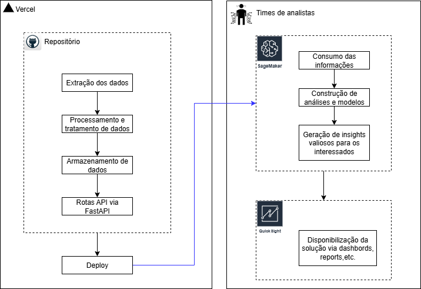

# API Pública para Consulta de Livros 

---

API robusta e eficiente para coleta, armazenamento e consulta de dados de livros do site "Books to Scrape" (https://books.toscrape.com/), projetada para garantir alta disponibilidade e segurança, potencializando seus projetos de ciência de dados com informações precisas e atualizadas. 

Autora: Alice Beatriz da Silva

Última atualização: 12/10/2025

Disponível em: https://pos-tech-machine-learning-engineer-eta.vercel.app/

Para efeitos de avaliação do projeto:
Prompt Design in Vertex AI Skill Badge: https://www.credly.com/badges/63f96b75-37e4-4db6-a2e3-fb341c03325e/linked_in?t=t3kzf2

---

## Índice

- [Funcionalidades e exemplo de uso](#funcionalidades-e-exemplo-de-uso)  
- [Estrutura do projeto](#estrutura-do-projeto)  
- [Tecnologias](#tecnologias)  
- [Instalacao e Configuracao](#instalacao-e-configuracao)
- [Escalabilidade](#escalabilidade)

---

## Funcionalidades e exemplo de uso

### Por que este projeto é ideal para cientistas de dados?

Este projeto facilita o trabalho repetitivo e burocrático da coleta e organização dos dados, permitindo que você foque no que realmente importa: gerar insights e construir modelos preditivos de alta qualidade.

- **Automatiza a coleta de dados**: raspagem eficiente e estruturada do site "Books to Scrape" (https://books.toscrape.com/), eliminando o trabalho manual e economizando tempo.
- **Armazenamento organizado**: dados salvos em formato CSV padrão, facilitando integração com ferramentas de análise e modelagem.
- **Consulta rápida e flexível**: API REST permite filtrar livros por título, categoria, ou ambos, agilizando a extração dos dados relevantes para suas análises.
- **Imagens acessíveis**: capas dos livros são baixadas e disponibilizadas via URL pública, enriquecendo dashboards e relatórios visuais.
- **Design escalável e seguro**: pensado para suportar aumento de volume e garantir a integridade dos dados, essencial para projetos que crescem com o tempo.
- **Fácil integração**: pode ser incorporado facilmente em pipelines de ciência de dados, machine learning e visualização, reduzindo barreiras técnicas.

### Arquitetura do Pipeline de Dados

O diagrama abaixo mostra o fluxo completo de dados — da coleta à entrega — usado neste projeto. Ele ajuda a entender como o sistema foi organizado para permitir extração automatizada, disponibilização via API e uso eficiente pelos times de análise e machine learning.




### Endpoints da API

| Método | Rota               | Descrição                                                              |
| ------ | ------------------ | ---------------------------------------------------------------------- |
| `GET`  | `/books`           | Retorna uma lista com os títulos de todos os livros.                   |
| `GET`  | `/books/{book_id}` | Retorna os detalhes completos de um livro com base no seu ID.          |
| `GET`  | `/books/search`    | Permite buscar livros por título, categoria ou ambos.                  |
| `GET`  | `/categories`      | Lista todas as categorias únicas disponíveis.                          |
| `GET`  | `/health`          | Verifica o status da API e da base de dados (útil para monitoramento). |


### Exemplos de uso

### `GET /books`: 

Lista todos os títulos disponíveis.

  ```
  https://pos-tech-machine-learning-engineer.vercel.app/api/v1/books
  ```


#### Resposta

```json
[
  "It's Only the Himalayas",
  "Tipping the Velvet",
  "Soumission",
  "Sharp Objects",
  "Sapiens",
  ...
]
```

### `GET /books/{book_id}`: 

Busca todas as informações de um livro por ID (exemplo ID = 1).

  ```
  https://pos-tech-machine-learning-engineer.vercel.app/api/v1/books/1
  ```

#### Resposta

```json
{
  "id": 1,
  "title": "It's Only the Himalayas",
  "price": 45.17,
  "availability": "In stock",
  "rating": "Two",
  "category": "Travel",
  "image_path": "https://alicebiasilva.github.io/Pos_Tech_Machine_Learning_Engineer/public/images/27a53d0bb95bdd88288eaf66c9230d7e.jpg"
}
```

### `GET /books/categories`: 

Lista todas as categorias disponíveis.
```
  https://pos-tech-machine-learning-engineer.vercel.app/api/v1/categories
  ```
#### Resposta

```json
{
  "categories": [
    "Travel",
    "Mystery",
    "Historical Fiction",
    "Science Fiction",
    "Poetry",
    ...
  ]
}
```

### `GET /books/search`: 

Buscar por título e/ou categoria juntos:

  ```
  https://pos-tech-machine-learning-engineer.vercel.app/api/v1/books/search?category=Travel
  ```

#### Resposta

```json
[
  {
    "title": "It's Only the Himalayas",
    "price": 45.17,
    "availability": "In stock",
    "rating": "Two",
    "category": "Travel",
    "image_path": "https://github.com/alicebiasilva/Pos_Tech_Machine_Learning_Engineer/blob/main/public/images/27a53d0bb95bdd88288eaf66c9230d7e.jpg",
    "id": 1
  },
  {
    "title": "Full Moon over Noah’s Ark: An Odyssey to Mount Ararat and Beyond",
    "price": 49.43,
    "availability": "In stock",
    "rating": "Four",
    "category": "Travel",
    "image_path": "https://github.com/alicebiasilva/Pos_Tech_Machine_Learning_Engineer/blob/main/public/images/57770cac1628f4407636635f4b85e88c.jpg",
    "id": 2
  },
  ...
]
```

### `GET /health`:

Valida saúde da API, ou seja, se as informações estão disponíveis:
```
  https://pos-tech-machine-learning-engineer.vercel.app/api/v1/health

  ```
### Resposta

```json
{
  "status": "ok"
}
```
 
## Estrutura do projeto

O projeto está organizado de forma modular, com os arquivos e pastas logicamente separados para facilitar manutenção, escalabilidade e reaproveitamento do código. Essa organização ajuda a manter o código limpo e claro, além de permitir que cada componente seja desenvolvido e testado isoladamente.

* A pasta `scrapping` contém as funções responsáveis por extrair os dados (`extract_data.py`) e carregar/salvar esses dados (`load_data.py`). Separar essas responsabilidades em arquivos distintos torna o projeto mais escalável, pois essas funções podem ser reaproveitadas ou expandidas futuramente sem impactar outras partes do sistema.
* A pasta `api` é dedicada à definição das rotas da API e ao armazenamento dos dados coletados, mantendo a lógica da aplicação desacoplada do processo de coleta.
* A pasta `public` guarda os recursos estáticos, como as imagens baixadas, garantindo que estejam acessíveis para a API e possíveis frontends.
* Arquivos como `main.py`, `requirements.txt` e `vercel.json` cuidam da inicialização da aplicação, das dependências e da configuração do deploy.

Essa separação clara e modular facilita o desenvolvimento colaborativo, o teste, a manutenção e a expansão futura do projeto.


| Caminho                          | Descrição                                                                 |
|----------------------------------|---------------------------------------------------------------------------|
| `api/data/books.csv`            | Arquivo CSV contendo os dados coletados dos livros                       |
| `api/routes.py`                 | Definição das rotas da API para consulta dos dados                       |
| `api/config.py`                 | Configurações gerais da aplicação (ex: chave secreta, cache)             |
| `api/__init__.py`              | Torna a pasta `api` um pacote Python                                     |
| `public/images/`               | Diretório onde as imagens dos livros são armazenadas após o download     |
| `scrapping/extract_data.py`    | Funções responsáveis pelo scraping dos dados do site                     |
| `scrapping/load_data.py`       | Funções para salvar os dados coletados em CSV                            |
| `scrapping/scrape_and_save.py` | Script que integra scraping e armazenamento dos dados                    |
| `scrapping/__init__.py`        | Torna a pasta `scrapping` um pacote Python                               |
| `main.py`                      | Script principal que inicia o scraping e roda a API                      |
| `requirements.txt`             | Lista das dependências Python necessárias para o projeto                 |
| `vercel.json`                  | Configurações para deploy no Vercel                                      |
| `.gitignore`                   | Arquivos e pastas ignorados pelo Git                                     |
| `README.md`                    | Documentação do projeto                                                  |

---

## Tecnologias

### Bibliotecas e Ferramentas de Desenvolvimento
- **FastAPI** – Framework para construir APIs rápidas e escaláveis.
- **Pandas** – Manipulação e análise de dados.
- **BeautifulSoup** – Raspagem e parsing de HTML.
- **Requests** – Requisições HTTP simples e elegantes.
- **Black** – Formatador de código Python para manter a consistência e qualidade do código.

### Tecnologias de Deploy e Versionamento
- **Vercel** – Plataforma para deploy e hospedagem rápida da API em produção.
- **GitHub** – Controle de versão e hospedagem do código-fonte.

### Destaques do Projeto

- **Código Modularizado:** O projeto é estruturado em módulos claros e organizados, facilitando manutenção e escalabilidade.
- **Código Limpo e Padronizado:** Uso do Black para garantir consistência e legibilidade do código.
- **Documentação Completa:** Todas as funções e classes possuem docstrings detalhadas, e o código está amplamente comentado para facilitar o entendimento.
- **API Bem Estruturada:** Endpoints claros e intuitivos para consulta eficiente dos dados coletados.
- **Frontend acessível** – Desenvolvido para facilitar o acesso e a interação com a API, proporcionando uma experiência amigável para os usuários.
- **Pronto para Produção:** Deploy simplificado via Vercel, garantindo alta disponibilidade e performance.

---

## Instalacao e Configuracao

Siga os passos abaixo para clonar, configurar e rodar o projeto localmente:

#### 1. Clone o repositório

```bash
git clone https://github.com/seu-usuario/seu-repo.git
cd seu-repo
```

#### 2. Crie um ambiente virtual (opcional, mas recomendado)

```bash
python -m venv venv
source venv/bin/activate  # Linux/macOS
venv\Scripts\activate     # Windows
```

#### 3. Instale as dependências

```bash
pip install -r requirements.txt
```

#### 4. Rode o scraper para coletar os dados

```bash
python scrapping/scrape_and_save.py
```

Esse comando irá:

* Fazer o scraping de todos os livros do site [Books to Scrape](https://books.toscrape.com/)
* Baixar as imagens dos livros
* Salvar os dados estruturados no arquivo `api/data/books.csv`

#### 5. Execute a API localmente

```bash
uvicorn main:app --reload
```

A API estará disponível em: [http://127.0.0.1:8000](http://127.0.0.1:8000)

#### 6. Acesse a documentação interativa (Swagger)

Após rodar o servidor, você pode visualizar e testar todas as rotas acessando:

```
http://127.0.0.1:8000/docs
```

---

## Escalabilidade

### Próximos passos

Entendemos que a construção de produtos robustos deve ser feita de forma contínua, colaborativa e centrada no usuário. Por isso, esta é a **primeira versão** do projeto — totalmente funcional, mas com espaço para melhorias e evolução.

Estamos abertos a feedbacks e já mapeamos algumas melhorias para as próximas entregas:

#### Automatização e Atualização

* **Definir frequência de atualização dos dados**, por exemplo via agendamento com `cron`, GitHub Actions ou cloud functions (AWS Lambda, Google Cloud Functions).
* **Agendar o scraping periodicamente**, garantindo que os dados estejam sempre atualizados.

#### Containerização com Docker

* Criar um `Dockerfile` e um `docker-compose.yml` para facilitar o deploy local e em produção.
* Padronizar ambientes para desenvolvedores e garantir portabilidade entre máquinas.

#### Banco de Dados em Nuvem

* Integrar a persistência dos dados com um banco de dados relacional (PostgreSQL, MySQL) ou NoSQL (MongoDB). Isso permitirá maior escalabilidade, consultas mais complexas e integração com dashboards.

#### Painéis e Visualização

* Criar um dashboard interativo (ex: Streamlit, Dash ou Power BI conectado via API) para visualização rápida dos livros, categorias e preços.
* Integrar com ferramentas de visual analytics para insights mais profundos.

#### Testes Automatizados

* Criar testes unitários e de integração com `pytest`.
* Configurar CI/CD no GitHub para rodar os testes automaticamente a cada push.

#### Versionamento Semântico

* Adotar versionamento semântico (`semver`) para releases (`v1.0.0`, `v1.1.0` etc).
* Manter changelog atualizado no GitHub.
